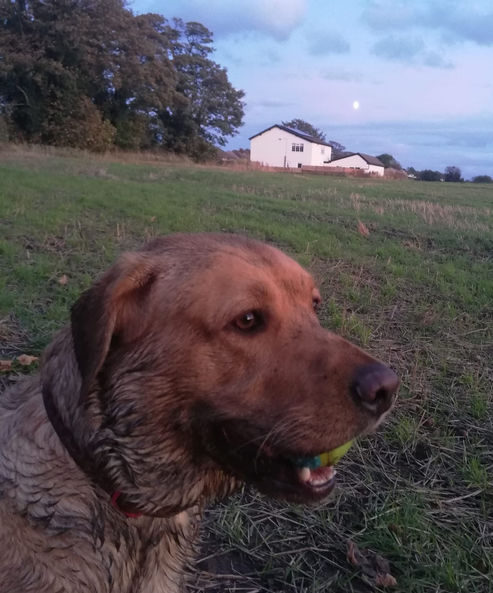

# Alpine All Paws

_Henri, Calvin, and Ripley_

### Dog walking, visiting, feeding and basic training services available in Alpine Estates and surrounding areas!

## Services

Heading out for the day but your dog wants to play? Available for a free introduction. References include referrals from Cranston police officers and RI State Troopers. Last minute is ok! Dogs with special needs will be accommodated - walk up, leash secure premium dog stroller provides fresh air and stimulation. Experience with puppies, elderly, blind and limited mobility pups. Animals love me and I love them back!

_Sparky_

_Harrison and Petey_

_Ruby_

## Availability

- Available all hours, including weekends, during summer
- Available in the early morning or late afternoon during the fall, Saturdays and Sundays flexible
- Available on school vacations per reservation

## Pricing

- Negotiable rates, based on agreement
- Estimated $10 per hour, bundle deals available

## Contact
Call or text Aidan at 401 486 3936!

